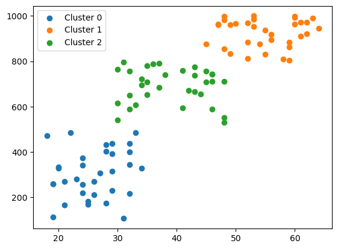
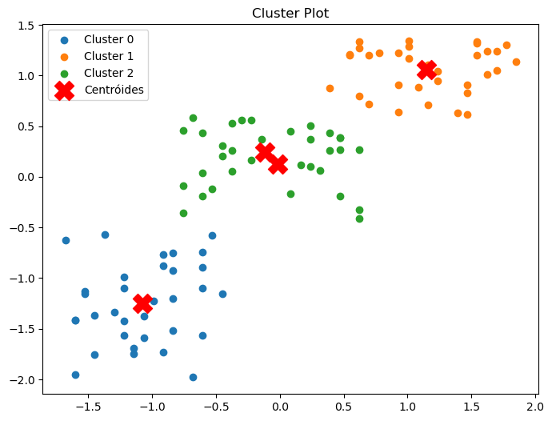

# 🧠 Customer Segmentation

Este projeto aplica técnicas de Machine Learning para segmentar clientes com base em seus comportamentos de compra. A análise é feita a partir de dados fictícios, com o objetivo de identificar grupos distintos de consumidores e apoiar estratégias de marketing direcionadas.

## 📊 Objetivo

O principal objetivo é aplicar algoritmos de clustering para agrupar clientes com perfis semelhantes, permitindo:

- Melhor compreensão do público-alvo
- Personalização de campanhas de marketing
- Otimização de recursos e investimentos

## 🛠️ Tecnologias Utilizadas

- Python
- Jupyter Notebook
- Pandas
- Matplotlib & Seaborn
- Scikit-learn

## 📌 Etapas do Projeto

1. **Exploração dos dados**: análise estatística e visual dos dados
2. **Pré-processamento**: limpeza e normalização
3. **Modelagem**: aplicação do algoritmo K-Means
4. **Avaliação**: uso do método do cotovelo para definir o número ideal de clusters
5. **Visualização**: gráficos para interpretar os grupos formados

## 📁 Biblioteca e Algoritmos utilizados:

##### Pré-Processamento :
- Matriz de Correlação
- StandScaler - Padronização
  
##### Seleção de variáveis mais importantes:
- PCA 
  
##### Modelo de Previsão:
- K-Means

##### Metricas:
- Silhouette_score
- Sse (Cotovelo)
- t-SNE


## 📷 Exemplos de Visualizações

As imagens mostram os clusters identificados e ajudam a entender os padrões de comportamento dos clientes.



## 📌 Como Executar

1. Clone o repositório:
   ```bash
   git clone https://github.com/jaquelinesfernandes/Customer_segmentation.git
